# 🌱 Samyang3 - 농산물 이커머스 플랫폼

간단한 CRUD 기능을 구현한 농산물 이커머스 토이 프로젝트입니다.

## 📋 목차
- [프로젝트 개요](#프로젝트-개요)
- [기술 스택](#기술-스택)
- [주요 기능](#주요-기능)
- [Use Case Diagram](#use-case-diagram)
- [Class Diagram](#class-diagram)
- [시스템 아키텍처](#시스템-아키텍처)
- [데이터베이스 구조](#데이터베이스-구조)
- [프로세스 플로우](#프로세스-플로우)
- [프로젝트 구조](#프로젝트-구조)
- [실행 방법](#실행-방법)

## 🎯 프로젝트 개요

Samyang3는 농산물(씨앗, 모종 등)을 판매하는 간단한 이커머스 플랫폼입니다. Spring Boot와 MyBatis를 기반으로 구현되었으며, 기본적인 쇼핑몰 기능과 커뮤니티 기능을 제공합니다.

## 🛠 기술 스택

### Backend
- **Java 17**
- **Spring Boot 3.3.0**
- **MyBatis 3.0.3**
- **MySQL 8.0**

### Frontend
- **JSP / JSTL**
- **HTML5 / CSS3**
- **JavaScript**

### Build Tool
- **Gradle 7.x**

## ✨ 주요 기능

### 사용자 기능
- **회원 관리**: 회원가입, 로그인, 마이페이지
- **상품 브라우징**: 카테고리별 상품 조회, 상품 상세 정보
- **장바구니**: 상품 추가/삭제/수량 변경
- **주문**: 주문 생성, 주문 내역 조회, 배송 정보 입력
- **리뷰**: 상품 리뷰 작성/수정/삭제
- **커뮤니티**: 게시글 작성/조회, 댓글 기능

### 관리자 기능
- **대시보드**: 주요 통계 확인
- **회원 관리**: 회원 목록 조회 및 관리
- **상품 관리**: 상품 등록/수정/삭제
- **주문 관리**: 주문 상태 변경, 배송 관리
- **게시글 관리**: 커뮤니티 게시글 관리

## 🎭 Use Case Diagram

시스템의 주요 액터(Actor)와 유스케이스(Use Case)를 나타낸 다이어그램입니다.

```mermaid
graph TB
    subgraph "Actors"
        Guest[비회원]
        User[회원]
        Admin[관리자]
    end
    
    subgraph "회원 관리"
        UC1[회원가입]
        UC2[로그인]
        UC3[마이페이지 조회]
        UC4[회원정보 수정]
        UC5[회원 탈퇴]
    end
    
    subgraph "상품 관리"
        UC6[상품 목록 조회]
        UC7[상품 상세 조회]
        UC8[상품 검색]
        UC9[장바구니 담기]
        UC10[장바구니 조회]
        UC11[장바구니 수정/삭제]
    end
    
    subgraph "주문 관리"
        UC12[주문하기]
        UC13[주문 내역 조회]
        UC14[주문 상태 조회]
        UC15[주문 취소]
    end
    
    subgraph "리뷰 관리"
        UC16[리뷰 작성]
        UC17[리뷰 조회]
        UC18[리뷰 수정]
        UC19[리뷰 삭제]
    end
    
    subgraph "커뮤니티"
        UC20[게시글 목록 조회]
        UC21[게시글 상세 조회]
        UC22[게시글 작성]
        UC23[게시글 수정/삭제]
        UC24[댓글 작성]
        UC25[댓글 수정/삭제]
    end
    
    subgraph "관리자 기능"
        UC26[대시보드 조회]
        UC27[회원 관리]
        UC28[상품 등록/수정/삭제]
        UC29[주문 관리]
        UC30[게시글 관리]
    end
    
    %% Guest relationships
    Guest --> UC1
    Guest --> UC2
    Guest --> UC6
    Guest --> UC7
    Guest --> UC8
    Guest --> UC20
    Guest --> UC21
    
    %% User relationships
    User --> UC2
    User --> UC3
    User --> UC4
    User --> UC5
    User --> UC6
    User --> UC7
    User --> UC8
    User --> UC9
    User --> UC10
    User --> UC11
    User --> UC12
    User --> UC13
    User --> UC14
    User --> UC15
    User --> UC16
    User --> UC17
    User --> UC18
    User --> UC19
    User --> UC20
    User --> UC21
    User --> UC22
    User --> UC23
    User --> UC24
    User --> UC25
    
    %% Admin relationships
    Admin --> UC26
    Admin --> UC27
    Admin --> UC28
    Admin --> UC29
    Admin --> UC30
    
    %% Include relationships
    UC12 -.include.-> UC10
    UC16 -.include.-> UC13
```

## 🏛️ Class Diagram

시스템의 주요 도메인 클래스와 그들 간의 관계를 나타낸 다이어그램입니다.

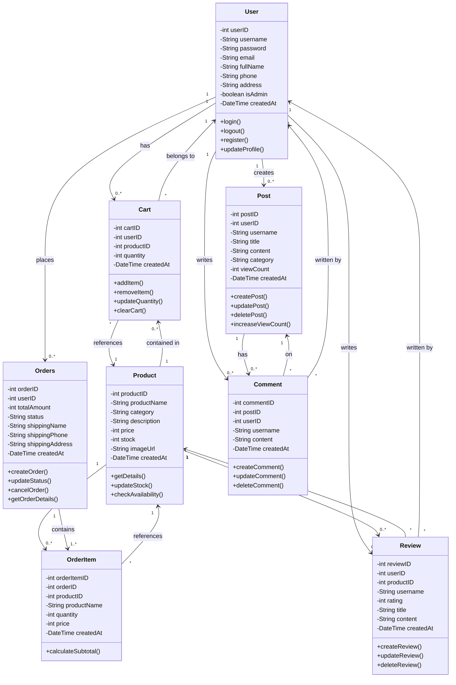

## 🏗 시스템 아키텍처

프로젝트는 전통적인 MVC 패턴을 따르며, 계층형 아키텍처로 구성되어 있습니다.

### 아키텍처 다이어그램


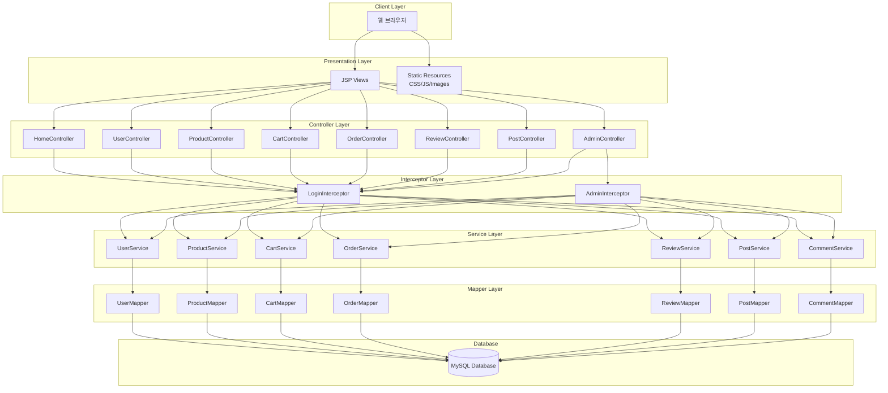


주요 구성 요소:
- **Controller Layer**: HTTP 요청을 처리하고 적절한 서비스를 호출
- **Service Layer**: 비즈니스 로직을 담당
- **Mapper Layer**: MyBatis를 통한 데이터베이스 접근
- **Interceptor**: 로그인 검증 및 권한 체크

## 💾 데이터베이스 구조

### ERD (Entity Relationship Diagram)
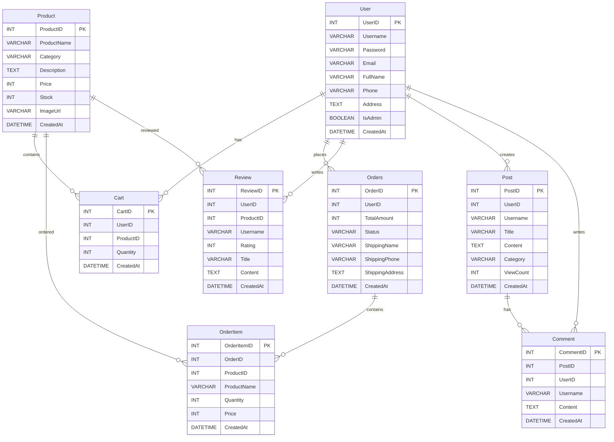


### 주요 테이블
- **User**: 사용자 정보 (일반/관리자)
- **Product**: 상품 정보
- **Cart**: 장바구니
- **Orders**: 주문 정보
- **OrderItem**: 주문 상품 상세
- **Review**: 상품 리뷰
- **Post**: 게시글
- **Comment**: 댓글

## 🔄 프로세스 플로우

### 주요 처리 흐름

## 사용자 요청 처리 흐름

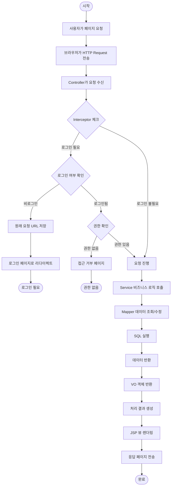

## 주문 처리 흐름

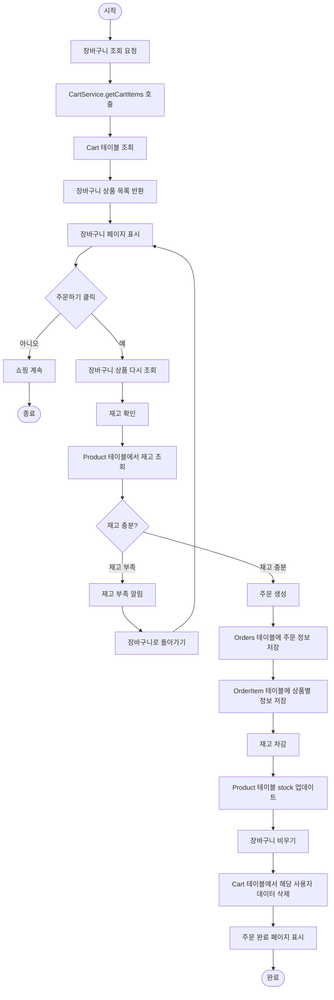

## 관리자 인증 흐름

```mermaid
flowchart TD
    Start([시작]) --> AdminAccess[/admin/* 페이지 접근]
    AdminAccess --> SendRequest[HTTP Request 전송]
    SendRequest --> InterceptorCheck[AdminInterceptor.preHandle 실행]
    InterceptorCheck --> GetSession[세션에서 사용자 정보 조회]
    
    GetSession --> CheckUser{사용자 정보 확인}
    
    CheckUser -->|비로그인| NoUser[사용자 정보 없음]
    NoUser --> RedirectLogin[로그인 페이지로 리다이렉트]
    RedirectLogin --> LoginRequired([로그인 필요])
    
    CheckUser -->|로그인됨| HasUser[사용자 정보 있음]
    HasUser --> CheckAdmin{관리자 권한 확인}
    
    CheckAdmin -->|일반 사용자| NotAdmin[isAdmin = false]
    NotAdmin --> ShowError[권한 없음 에러 페이지]
    ShowError --> AccessDenied([접근 거부])
    
    CheckAdmin -->|관리자| IsAdmin[isAdmin = true]
    IsAdmin --> AllowRequest[요청 진행 허용]
    AllowRequest --> ProcessRequest[AdminController 처리]
    ProcessRequest --> RenderPage[관리자 페이지 렌더링]
    RenderPage --> End([완료])
```

## 로그인 처리 흐름

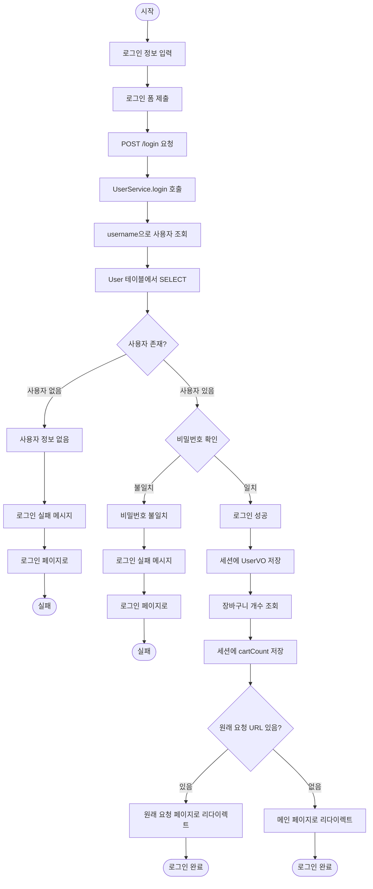

## 회원가입 처리 흐름

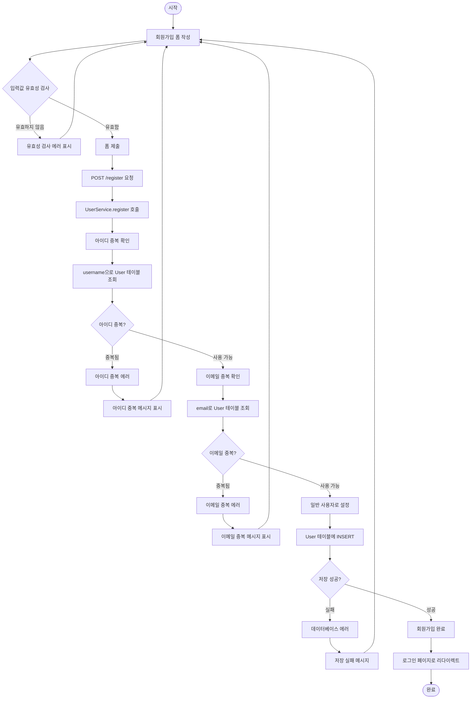

## 장바구니 추가 처리 흐름

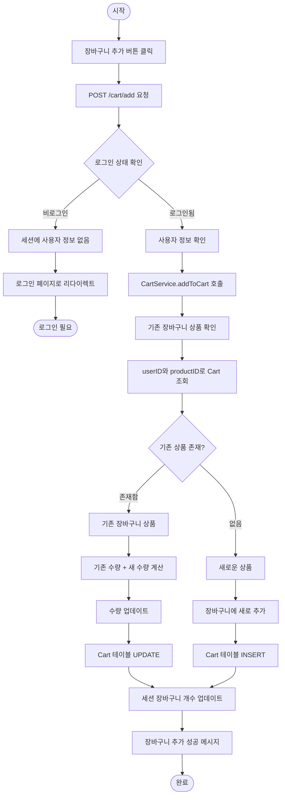

## 상품 리뷰 작성 흐름

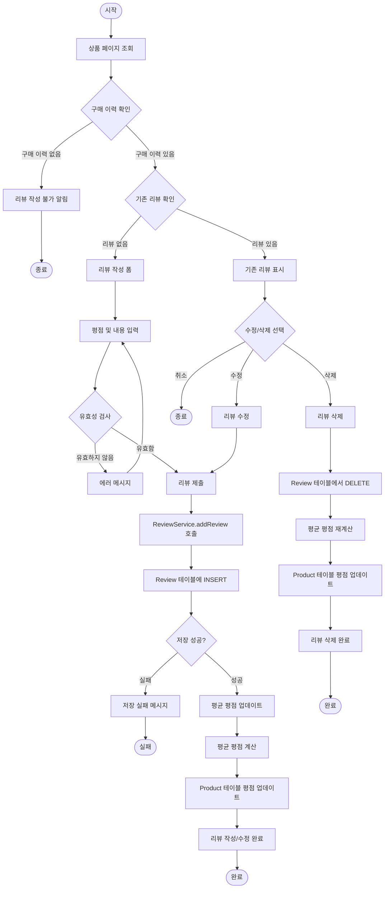

## 게시글 작성 및 댓글 처리 흐름

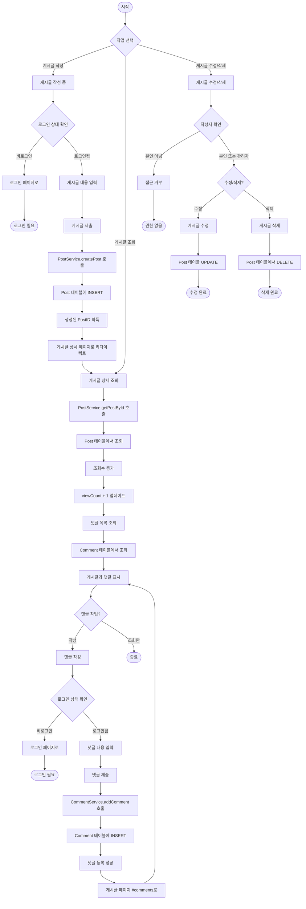

## 관리자 대시보드 조회 흐름

```mermaid
flowchart TD
    Start([시작]) --> AccessDashboard[관리자 대시보드 접근]
    AccessDashboard --> AdminRequest[GET /admin/dashboard 요청]
    AdminRequest --> AdminInterceptor[관리자 인터셉터 체크]
    AdminInterceptor --> CheckAdminAuth{관리자 권한 확인}
    
    CheckAdminAuth -->|권한 없음| DenyAccess[접근 거부]
    DenyAccess --> End1([권한 없음])
    
    CheckAdminAuth -->|관리자 확인| AllowAccess[요청 진행 허용]
    AllowAccess --> LoadStats[통계 데이터 로드]
    
    LoadStats --> GetUserCount[회원 수 조회]
    GetUserCount --> QueryUserCount[SELECT COUNT(*) FROM User]
    QueryUserCount --> UserCount[150명]
    
    UserCount --> GetProductCount[상품 수 조회]
    GetProductCount --> QueryProductCount[SELECT COUNT(*) FROM Product]
    QueryProductCount --> ProductCount[50개]
    
    ProductCount --> GetOrderCount[주문 수 조회]
    GetOrderCount --> QueryOrderCount[SELECT COUNT(*) FROM Orders]
    QueryOrderCount --> OrderCount[320건]
    
    OrderCount --> GetPendingOrders[대기 중 주문 조회]
    GetPendingOrders --> QueryPending[SELECT * FROM Orders WHERE status = 'PENDING']
    QueryPending --> PendingList[대기 주문 목록]
    
    PendingList --> GetRecentOrders[최근 주문 조회]
    GetRecentOrders --> QueryRecent[SELECT * FROM Orders ORDER BY createdAt DESC LIMIT 10]
    QueryRecent --> RecentList[최근 주문 10건]
    
    RecentList --> PrepareData[대시보드 데이터 준비]
    PrepareData --> RenderDashboard[대시보드 페이지 렌더링]
    RenderDashboard --> ShowDashboard[통계 및 주문 정보 표시]
    ShowDashboard --> End2([완료])
```

## 상품 검색 처리 흐름

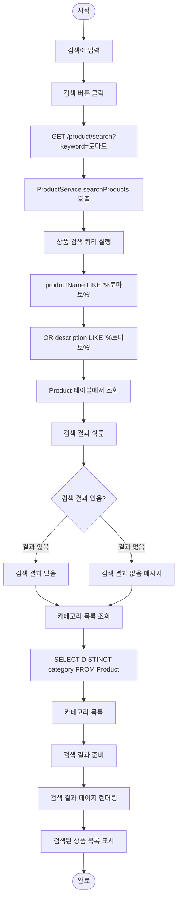

## 주문 상태 변경 흐름 (관리자)

```mermaid
flowchart TD
    Start([시작]) --> SelectOrder[변경할 주문 선택]
    SelectOrder --> SelectStatus[새로운 상태 선택]
    SelectStatus --> SubmitChange[상태 변경 요청]
    SubmitChange --> PostRequest[POST /admin/order/updateStatus]
    
    PostRequest --> CallUpdate[OrderService.updateOrderStatus 호출]
    CallUpdate --> GetOrder[주문 정보 조회]
    GetOrder --> QueryOrder[SELECT * FROM Orders WHERE orderID = ?]
    QueryOrder --> CheckStatus{현재 상태 확인}
    
    CheckStatus -->|이미 배송 시작| ShippedStatus[status = "SHIPPED"]
    ShippedStatus --> CannotCancel[취소 불가능]
    CannotCancel --> ShowError[상태 변경 불가 메시지]
    ShowError --> End1([변경 불가])
    
    CheckStatus -->|변경 가능| CanChange[상태 변경 가능]
    CanChange --> UpdateStatus[주문 상태 업데이트]
    UpdateStatus --> UpdateOrder[UPDATE Orders SET status = ?]
    
    UpdateOrder --> CheckCancellation{주문 취소인가?}
    CheckCancellation -->|아니오| NotCancellation[일반 상태 변경]
    CheckCancellation -->|예| IsCancellation[주문 취소 처리]
    
    IsCancellation --> GetOrderItems[주문 상품 목록 조회]
    GetOrderItems --> RestoreStock[재고 복원]
    RestoreStock --> UpdateStock[UPDATE Product SET stock = stock + ?]
    
    UpdateStock --> UpdateSuccess[상태 변경 성공]
    NotCancellation --> UpdateSuccess
    UpdateSuccess --> RefreshOrder[주문 정보 새로고침]
    RefreshOrder --> ShowUpdated[업데이트된 주문 정보 표시]
    ShowUpdated --> End2([완료])
```

### 비즈니스 프로세스 플로우차트

## 회원가입 프로세스


## 상품 구매 전체 프로세스

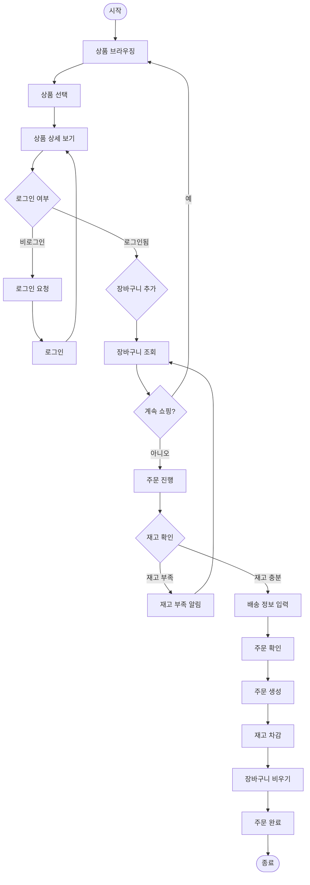

## 리뷰 작성 프로세스

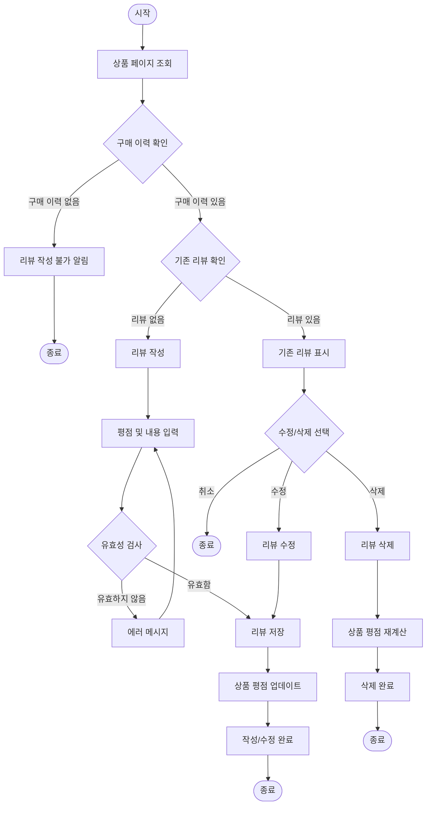

## 상품 관리 프로세스 (관리자)

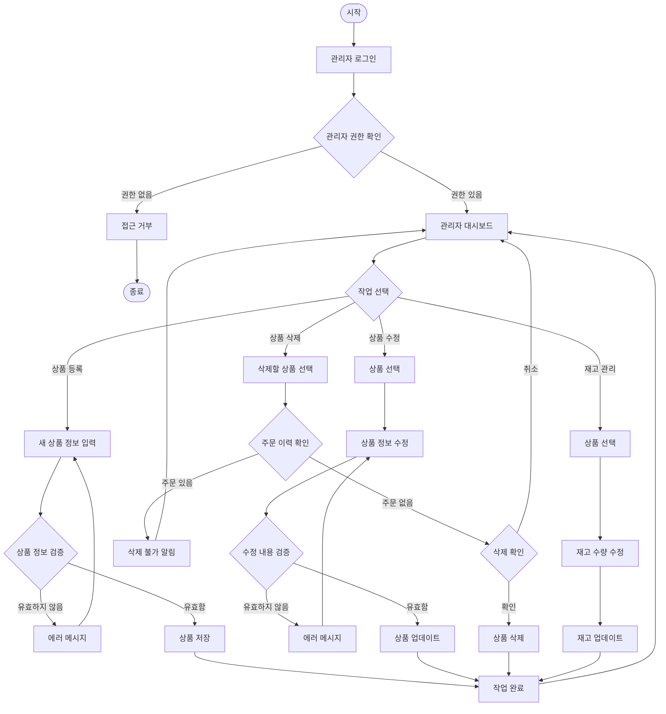


시스템의 주요 프로세스:
1. **사용자 요청 처리**: 인터셉터를 통한 인증/인가 후 요청 처리
2. **주문 처리**: 장바구니 → 재고 확인 → 주문 생성 → 재고 차감
3. **관리자 인증**: 관리자 권한 확인 후 관리 페이지 접근
4. **회원가입**: 입력값 검증 → 중복 확인 → 사용자 생성
5. **상품 구매**: 상품 선택 → 장바구니 → 주문 → 결제 완료
6. **리뷰 작성**: 구매 확인 → 리뷰 작성/수정 → 평점 업데이트
7. **상품 관리**: 권한 확인 → 상품 CRUD → 재고 관리

## 📁 프로젝트 구조

```
samyang3/
├── src/
│   ├── main/
│   │   ├── java/com/farm404/samyang3/
│   │   │   ├── config/          # 설정 클래스
│   │   │   ├── controller/      # 컨트롤러
│   │   │   ├── domain/          # VO 클래스
│   │   │   ├── interceptor/     # 인터셉터
│   │   │   ├── mapper/          # MyBatis 매퍼
│   │   │   ├── service/         # 서비스 클래스
│   │   │   └── util/            # 유틸리티
│   │   ├── resources/
│   │   │   ├── mapper/          # MyBatis XML
│   │   │   ├── static/          # 정적 리소스
│   │   │   └── application.properties
│   │   └── webapp/WEB-INF/views/ # JSP 뷰
│   └── test/                    # 테스트 코드
├── docs/                        # 문서 및 다이어그램
├── build.gradle                 # Gradle 빌드 설정
└── schema.sql                   # 데이터베이스 스키마
```

## 🚀 실행 방법

### 사전 요구사항
- JDK 17 이상
- MySQL 8.0 이상
- Gradle 7.x 이상

### 실행 단계

1. **데이터베이스 설정**
   ```sql
   -- schema.sql 파일 실행하여 데이터베이스 및 테이블 생성
   mysql -h localhost -u root -p < schema.sql
   ```

2. **애플리케이션 설정**
   ```properties
   # src/main/resources/application.properties 수정
   spring.datasource.url=jdbc:mysql://localhost:3306/samyang
   spring.datasource.username=your_username
   spring.datasource.password=your_password
   ```

3. **애플리케이션 실행**
   ```bash
   ./gradlew bootRun
   ```

4. **접속**
   - 일반 사용자: http://localhost:8080
   - 관리자: http://localhost:8080/admin
   - 기본 관리자 계정: admin / 1234

## 📝 라이센스

이 프로젝트는 학습 목적의 토이 프로젝트입니다.
