# 🌱 Samyang3 - 농산물 이커머스 플랫폼

간단한 CRUD 기능을 구현한 농산물 이커머스 토이 프로젝트입니다.

## 📋 목차
- [프로젝트 개요](#프로젝트-개요)
- [기술 스택](#기술-스택)
- [주요 기능](#주요-기능)
- [Use Case Diagram](#use-case-diagram)
- [Class Diagram](#class-diagram)
- [시스템 아키텍처](#시스템-아키텍처)
- [데이터베이스 구조](#데이터베이스-구조)
- [프로세스 플로우](#프로세스-플로우)
- [프로젝트 구조](#프로젝트-구조)
- [실행 방법](#실행-방법)

## 🎯 프로젝트 개요

Samyang3는 농산물(씨앗, 모종 등)을 판매하는 간단한 이커머스 플랫폼입니다. Spring Boot와 MyBatis를 기반으로 구현되었으며, 기본적인 쇼핑몰 기능과 커뮤니티 기능을 제공합니다.

## 🛠 기술 스택

### Backend
- **Java 17**
- **Spring Boot 3.3.0**
- **MyBatis 3.0.3**
- **MySQL 8.0**

### Frontend
- **JSP / JSTL**
- **HTML5 / CSS3**
- **JavaScript**

### Build Tool
- **Gradle 7.x**

## ✨ 주요 기능

### 사용자 기능
- **회원 관리**: 회원가입, 로그인, 마이페이지
- **상품 브라우징**: 카테고리별 상품 조회, 상품 상세 정보
- **장바구니**: 상품 추가/삭제/수량 변경
- **주문**: 주문 생성, 주문 내역 조회, 배송 정보 입력
- **리뷰**: 상품 리뷰 작성/수정/삭제
- **커뮤니티**: 게시글 작성/조회, 댓글 기능

### 관리자 기능
- **대시보드**: 주요 통계 확인
- **회원 관리**: 회원 목록 조회 및 관리
- **상품 관리**: 상품 등록/수정/삭제
- **주문 관리**: 주문 상태 변경, 배송 관리
- **게시글 관리**: 커뮤니티 게시글 관리

## 🎭 Use Case Diagram

시스템의 주요 액터(Actor)와 유스케이스(Use Case)를 나타낸 다이어그램입니다.


## 🏛️ Class Diagram

시스템의 주요 도메인 클래스와 그들 간의 관계를 나타낸 다이어그램입니다.


## 🏗 시스템 아키텍처

프로젝트는 전통적인 MVC 패턴을 따르며, 계층형 아키텍처로 구성되어 있습니다.

### 아키텍처 다이어그램


주요 구성 요소:
- **Controller Layer**: HTTP 요청을 처리하고 적절한 서비스를 호출
- **Service Layer**: 비즈니스 로직을 담당
- **Mapper Layer**: MyBatis를 통한 데이터베이스 접근
- **Interceptor**: 로그인 검증 및 권한 체크

## 💾 데이터베이스 구조

### ERD (Entity Relationship Diagram)

```mermaid
erDiagram
    User {
        INT UserID PK
        VARCHAR Username
        VARCHAR Password
        VARCHAR Email
        VARCHAR FullName
        VARCHAR Phone
        TEXT Address
        BOOLEAN IsAdmin
        DATETIME CreatedAt
    }
    
    Product {
        INT ProductID PK
        VARCHAR ProductName
        VARCHAR Category
        TEXT Description
        INT Price
        INT Stock
        VARCHAR ImageUrl
        DATETIME CreatedAt
    }
    
    Cart {
        INT CartID PK
        INT UserID
        INT ProductID
        INT Quantity
        DATETIME CreatedAt
    }
    
    Orders {
        INT OrderID PK
        INT UserID
        INT TotalAmount
        VARCHAR Status
        VARCHAR ShippingName
        VARCHAR ShippingPhone
        TEXT ShippingAddress
        DATETIME CreatedAt
    }
    
    OrderItem {
        INT OrderItemID PK
        INT OrderID
        INT ProductID
        VARCHAR ProductName
        INT Quantity
        INT Price
        DATETIME CreatedAt
    }
    
    Review {
        INT ReviewID PK
        INT UserID
        INT ProductID
        VARCHAR Username
        INT Rating
        VARCHAR Title
        TEXT Content
        DATETIME CreatedAt
    }
    
    Post {
        INT PostID PK
        INT UserID
        VARCHAR Username
        VARCHAR Title
        TEXT Content
        VARCHAR Category
        INT ViewCount
        DATETIME CreatedAt
    }
    
    Comment {
        INT CommentID PK
        INT PostID
        INT UserID
        VARCHAR Username
        TEXT Content
        DATETIME CreatedAt
    }
    
    User ||--o{ Cart : "has"
    User ||--o{ Orders : "places"
    User ||--o{ Review : "writes"
    User ||--o{ Post : "creates"
    User ||--o{ Comment : "writes"
    Product ||--o{ Cart : "contains"
    Product ||--o{ OrderItem : "ordered"
    Product ||--o{ Review : "reviewed"
    Orders ||--o{ OrderItem : "contains"
    Post ||--o{ Comment : "has"
```



### 주요 테이블
- **User**: 사용자 정보 (일반/관리자)
- **Product**: 상품 정보
- **Cart**: 장바구니
- **Orders**: 주문 정보
- **OrderItem**: 주문 상품 상세
- **Review**: 상품 리뷰
- **Post**: 게시글
- **Comment**: 댓글

## 🔄 프로세스 플로우

### 주요 처리 흐름

## 사용자 요청 처리 흐름


## 주문 처리 흐름


## 관리자 인증 흐름


## 로그인 처리 흐름


## 회원가입 처리 흐름


## 장바구니 추가 처리 흐름


## 상품 리뷰 작성 흐름


## 게시글 작성 및 댓글 처리 흐름


## 관리자 대시보드 조회 흐름


## 상품 검색 처리 흐름


## 주문 상태 변경 흐름 (관리자)


### 비즈니스 프로세스 플로우차트

## 회원가입 프로세스


## 상품 구매 전체 프로세스


## 리뷰 작성 프로세스


## 상품 관리 프로세스 (관리자)


시스템의 주요 프로세스:
1. **사용자 요청 처리**: 인터셉터를 통한 인증/인가 후 요청 처리
2. **주문 처리**: 장바구니 → 재고 확인 → 주문 생성 → 재고 차감
3. **관리자 인증**: 관리자 권한 확인 후 관리 페이지 접근
4. **회원가입**: 입력값 검증 → 중복 확인 → 사용자 생성
5. **상품 구매**: 상품 선택 → 장바구니 → 주문 → 결제 완료
6. **리뷰 작성**: 구매 확인 → 리뷰 작성/수정 → 평점 업데이트
7. **상품 관리**: 권한 확인 → 상품 CRUD → 재고 관리

## 📁 프로젝트 구조

```
samyang3/
├── src/
│   ├── main/
│   │   ├── java/com/farm404/samyang3/
│   │   │   ├── config/          # 설정 클래스
│   │   │   ├── controller/      # 컨트롤러
│   │   │   ├── domain/          # VO 클래스
│   │   │   ├── interceptor/     # 인터셉터
│   │   │   ├── mapper/          # MyBatis 매퍼
│   │   │   ├── service/         # 서비스 클래스
│   │   │   └── util/            # 유틸리티
│   │   ├── resources/
│   │   │   ├── mapper/          # MyBatis XML
│   │   │   ├── static/          # 정적 리소스
│   │   │   └── application.properties
│   │   └── webapp/WEB-INF/views/ # JSP 뷰
│   └── test/                    # 테스트 코드
├── docs/                        # 문서 및 다이어그램
├── build.gradle                 # Gradle 빌드 설정
└── schema.sql                   # 데이터베이스 스키마
```

## 🚀 실행 방법

### 사전 요구사항
- JDK 17 이상
- MySQL 8.0 이상
- Gradle 7.x 이상

### 실행 단계

1. **데이터베이스 설정**
   ```sql
   -- schema.sql 파일 실행하여 데이터베이스 및 테이블 생성
   mysql -h localhost -u root -p < schema.sql
   ```

2. **애플리케이션 설정**
   ```properties
   # src/main/resources/application.properties 수정
   spring.datasource.url=jdbc:mysql://localhost:3306/samyang
   spring.datasource.username=your_username
   spring.datasource.password=your_password
   ```

3. **애플리케이션 실행**
   ```bash
   ./gradlew bootRun
   ```

4. **접속**
   - 일반 사용자: http://localhost:8080
   - 관리자: http://localhost:8080/admin
   - 기본 관리자 계정: admin / 1234

## 📝 라이센스

이 프로젝트는 학습 목적의 토이 프로젝트입니다.
