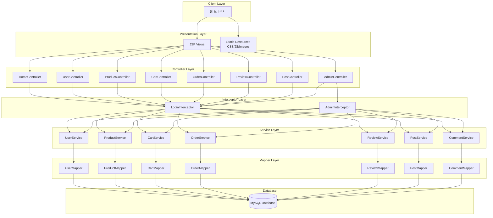

# 시스템 아키텍처 다이어그램

## 전체 시스템 구조

## 설명

이 다이어그램은 Samyang3 프로젝트의 전체 시스템 아키텍처를 보여줍니다.

- **Client Layer**: 사용자가 웹 브라우저를 통해 시스템에 접근
- **Presentation Layer**: JSP 뷰와 정적 리소스로 구성
- **Controller Layer**: 각 도메인별 컨트롤러가 요청을 처리
- **Interceptor Layer**: 로그인 검증 및 관리자 권한 체크
- **Service Layer**: 비즈니스 로직 처리
- **Mapper Layer**: MyBatis를 사용한 데이터베이스 접근
- **Database**: MySQL 데이터베이스