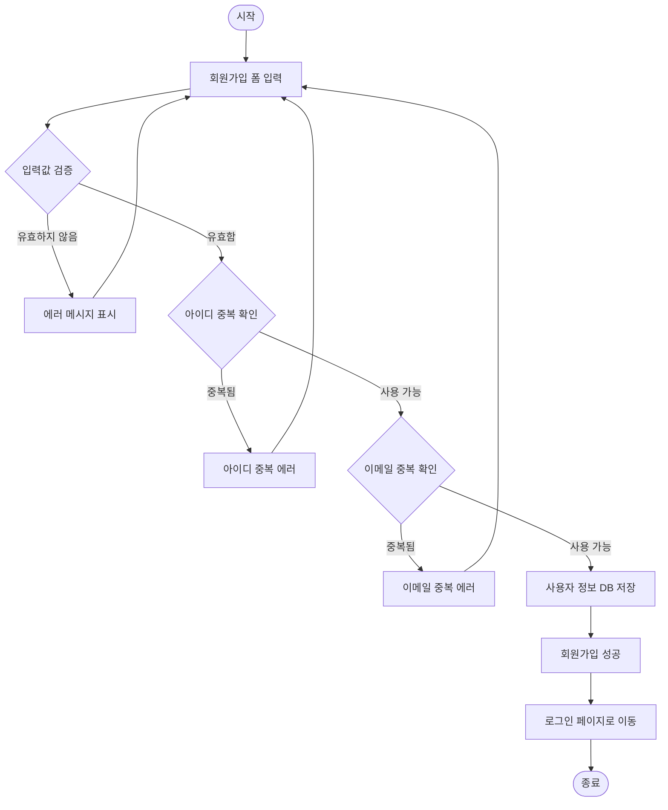
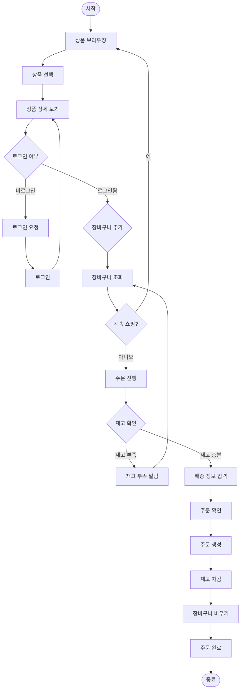
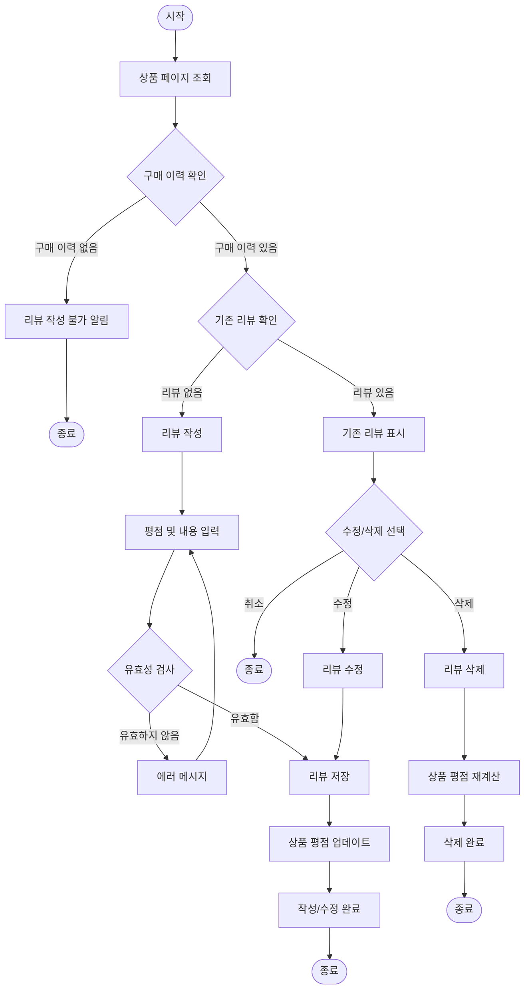
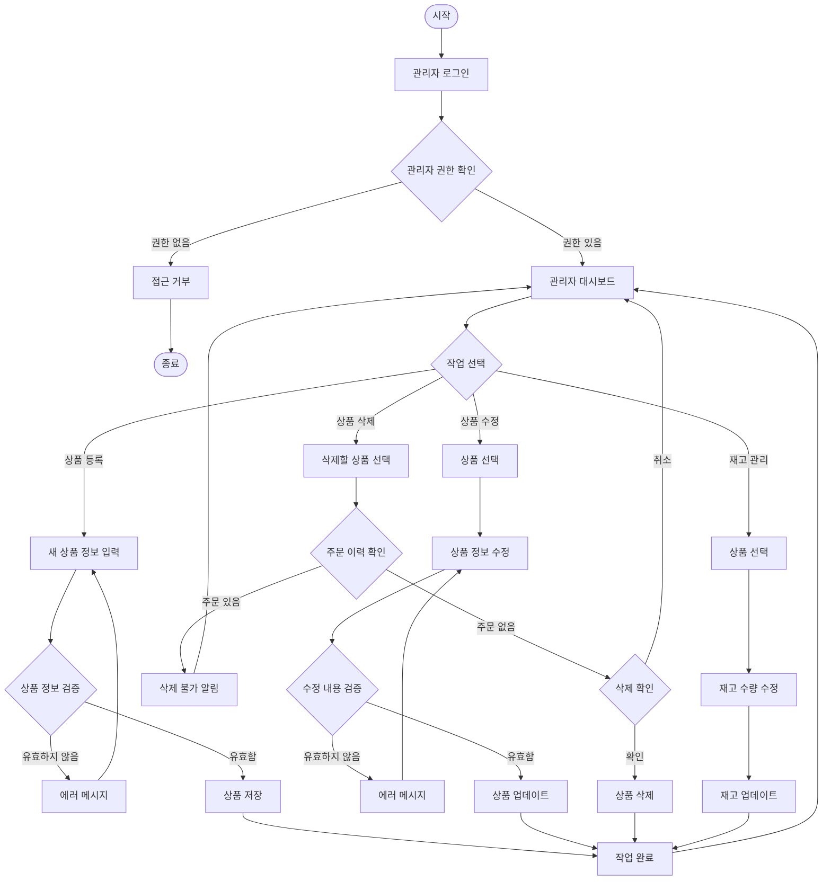

# 비즈니스 프로세스 플로우차트

## 회원가입 프로세스

```mermaid
flowchart TD
    Start([시작]) --> InputForm[회원가입 폼 입력]
    InputForm --> ValidateInput{입력값 검증}
    
    ValidateInput -->|유효하지 않음| ShowError[에러 메시지 표시]
    ShowError --> InputForm
    
    ValidateInput -->|유효함| CheckUsername{아이디 중복 확인}
    CheckUsername -->|중복됨| UsernameError[아이디 중복 에러]
    UsernameError --> InputForm
    
    CheckUsername -->|사용 가능| CheckEmail{이메일 중복 확인}
    CheckEmail -->|중복됨| EmailError[이메일 중복 에러]
    EmailError --> InputForm
    
    CheckEmail -->|사용 가능| CreateUser[사용자 정보 DB 저장]
    CreateUser --> Success[회원가입 성공]
    Success --> RedirectLogin[로그인 페이지로 이동]
    RedirectLogin --> End([종료])
```

## 상품 구매 전체 프로세스

```mermaid
flowchart TD
    Start([시작]) --> Browse[상품 브라우징]
    Browse --> SelectProduct[상품 선택]
    SelectProduct --> ViewDetail[상품 상세 보기]
    
    ViewDetail --> CheckLogin{로그인 여부}
    CheckLogin -->|비로그인| LoginPrompt[로그인 요청]
    LoginPrompt --> Login[로그인]
    Login --> ViewDetail
    
    CheckLogin -->|로그인됨| AddCart{장바구니 추가}
    AddCart --> ViewCart[장바구니 조회]
    
    ViewCart --> ContinueShopping{계속 쇼핑?}
    ContinueShopping -->|예| Browse
    ContinueShopping -->|아니오| ProceedOrder[주문 진행]
    
    ProceedOrder --> CheckStock{재고 확인}
    CheckStock -->|재고 부족| StockError[재고 부족 알림]
    StockError --> ViewCart
    
    CheckStock -->|재고 충분| InputShipping[배송 정보 입력]
    InputShipping --> ConfirmOrder[주문 확인]
    ConfirmOrder --> CreateOrder[주문 생성]
    
    CreateOrder --> UpdateStock[재고 차감]
    UpdateStock --> ClearCart[장바구니 비우기]
    ClearCart --> OrderComplete[주문 완료]
    OrderComplete --> End([종료])
```

## 리뷰 작성 프로세스

```mermaid
flowchart TD
    Start([시작]) --> ViewProduct[상품 페이지 조회]
    ViewProduct --> CheckPurchase{구매 이력 확인}
    
    CheckPurchase -->|구매 이력 없음| NoPurchase[리뷰 작성 불가 알림]
    NoPurchase --> End1([종료])
    
    CheckPurchase -->|구매 이력 있음| CheckExisting{기존 리뷰 확인}
    CheckExisting -->|리뷰 있음| ShowExisting[기존 리뷰 표시]
    ShowExisting --> EditOption{수정/삭제 선택}
    
    EditOption -->|수정| EditReview[리뷰 수정]
    EditOption -->|삭제| DeleteReview[리뷰 삭제]
    EditOption -->|취소| End2([종료])
    
    CheckExisting -->|리뷰 없음| WriteReview[리뷰 작성]
    WriteReview --> InputReview[평점 및 내용 입력]
    
    InputReview --> ValidateReview{유효성 검사}
    ValidateReview -->|유효하지 않음| ReviewError[에러 메시지]
    ReviewError --> InputReview
    
    ValidateReview -->|유효함| SaveReview[리뷰 저장]
    EditReview --> SaveReview
    SaveReview --> UpdateRating[상품 평점 업데이트]
    UpdateRating --> Success[작성/수정 완료]
    
    DeleteReview --> UpdateRating2[상품 평점 재계산]
    UpdateRating2 --> DeleteSuccess[삭제 완료]
    
    Success --> End3([종료])
    DeleteSuccess --> End4([종료])
```

## 상품 관리 프로세스 (관리자)

```mermaid
flowchart TD
    Start([시작]) --> AdminLogin[관리자 로그인]
    AdminLogin --> CheckAdmin{관리자 권한 확인}
    
    CheckAdmin -->|권한 없음| AccessDenied[접근 거부]
    AccessDenied --> End1([종료])
    
    CheckAdmin -->|권한 있음| AdminDashboard[관리자 대시보드]
    AdminDashboard --> SelectAction{작업 선택}
    
    SelectAction -->|상품 등록| NewProduct[새 상품 정보 입력]
    NewProduct --> ValidateProduct{상품 정보 검증}
    ValidateProduct -->|유효하지 않음| ProductError[에러 메시지]
    ProductError --> NewProduct
    ValidateProduct -->|유효함| SaveProduct[상품 저장]
    
    SelectAction -->|상품 수정| SelectProduct[상품 선택]
    SelectProduct --> EditProduct[상품 정보 수정]
    EditProduct --> ValidateEdit{수정 내용 검증}
    ValidateEdit -->|유효하지 않음| EditError[에러 메시지]
    EditError --> EditProduct
    ValidateEdit -->|유효함| UpdateProduct[상품 업데이트]
    
    SelectAction -->|상품 삭제| SelectDelete[삭제할 상품 선택]
    SelectDelete --> CheckOrders{주문 이력 확인}
    CheckOrders -->|주문 있음| DeleteWarning[삭제 불가 알림]
    DeleteWarning --> AdminDashboard
    CheckOrders -->|주문 없음| ConfirmDelete{삭제 확인}
    ConfirmDelete -->|취소| AdminDashboard
    ConfirmDelete -->|확인| DeleteProduct[상품 삭제]
    
    SelectAction -->|재고 관리| SelectStock[상품 선택]
    SelectStock --> UpdateStock[재고 수량 수정]
    UpdateStock --> SaveStock[재고 업데이트]
    
    SaveProduct --> Success[작업 완료]
    UpdateProduct --> Success
    DeleteProduct --> Success
    SaveStock --> Success
    
    Success --> AdminDashboard
```