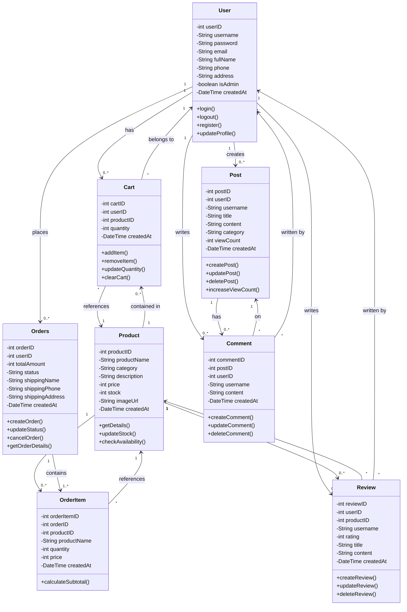

# Class Diagram

시스템의 주요 도메인 클래스와 그들 간의 관계를 나타낸 다이어그램입니다.

```mermaid
classDiagram
    class User {
        -int userID
        -String username
        -String password
        -String email
        -String fullName
        -String phone
        -String address
        -boolean isAdmin
        -DateTime createdAt
        +login()
        +logout()
        +register()
        +updateProfile()
    }
    
    class Product {
        -int productID
        -String productName
        -String category
        -String description
        -int price
        -int stock
        -String imageUrl
        -DateTime createdAt
        +getDetails()
        +updateStock()
        +checkAvailability()
    }
    
    class Cart {
        -int cartID
        -int userID
        -int productID
        -int quantity
        -DateTime createdAt
        +addItem()
        +removeItem()
        +updateQuantity()
        +clearCart()
    }
    
    class Orders {
        -int orderID
        -int userID
        -int totalAmount
        -String status
        -String shippingName
        -String shippingPhone
        -String shippingAddress
        -DateTime createdAt
        +createOrder()
        +updateStatus()
        +cancelOrder()
        +getOrderDetails()
    }
    
    class OrderItem {
        -int orderItemID
        -int orderID
        -int productID
        -String productName
        -int quantity
        -int price
        -DateTime createdAt
        +calculateSubtotal()
    }
    
    class Review {
        -int reviewID
        -int userID
        -int productID
        -String username
        -int rating
        -String title
        -String content
        -DateTime createdAt
        +createReview()
        +updateReview()
        +deleteReview()
    }
    
    class Post {
        -int postID
        -int userID
        -String username
        -String title
        -String content
        -String category
        -int viewCount
        -DateTime createdAt
        +createPost()
        +updatePost()
        +deletePost()
        +increaseViewCount()
    }
    
    class Comment {
        -int commentID
        -int postID
        -int userID
        -String username
        -String content
        -DateTime createdAt
        +createComment()
        +updateComment()
        +deleteComment()
    }
    
    %% Relationships
    User "1" --> "0..*" Cart : has
    User "1" --> "0..*" Orders : places
    User "1" --> "0..*" Review : writes
    User "1" --> "0..*" Post : creates
    User "1" --> "0..*" Comment : writes
    
    Product "1" --> "0..*" Cart : contained in
    Product "1" --> "0..*" OrderItem : ordered in
    Product "1" --> "0..*" Review : reviewed by
    
    Orders "1" --> "1..*" OrderItem : contains
    Post "1" --> "0..*" Comment : has
    
    Cart "*" --> "1" Product : references
    Cart "*" --> "1" User : belongs to
    OrderItem "*" --> "1" Product : references
    Review "*" --> "1" Product : about
    Review "*" --> "1" User : written by
    Comment "*" --> "1" Post : on
    Comment "*" --> "1" User : written by
```