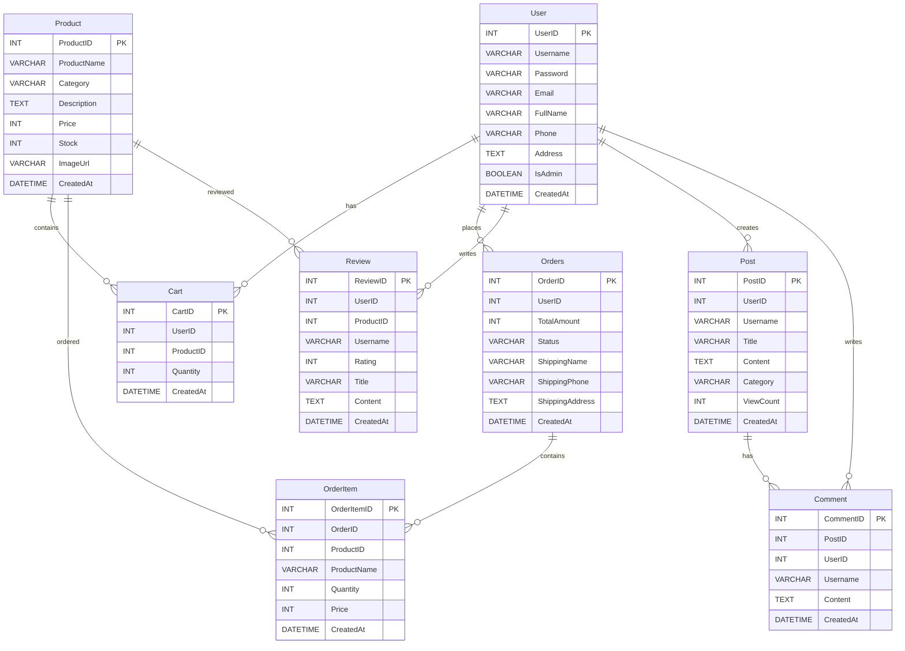

# 데이터베이스 ERD (Entity Relationship Diagram)

## Samyang3 데이터베이스 구조

## 테이블 설명

### User (사용자)
- 시스템의 모든 사용자 정보를 저장
- IsAdmin 필드로 관리자와 일반 사용자를 구분

### Product (상품)
- 판매되는 농산물 상품 정보
- 카테고리별로 분류 가능

### Cart (장바구니)
- 사용자별 장바구니 아이템 관리
- 사용자는 여러 상품을 장바구니에 담을 수 있음

### Orders (주문)
- 완료된 주문 정보
- 배송 정보와 주문 상태 관리

### OrderItem (주문 상품)
- 각 주문에 포함된 상품 상세 정보
- 주문 시점의 가격과 수량 저장

### Review (리뷰)
- 상품에 대한 사용자 리뷰
- 별점과 텍스트 리뷰 포함

### Post (게시글)
- 커뮤니티 게시글
- 카테고리별 분류 및 조회수 관리

### Comment (댓글)
- 게시글에 대한 댓글
- 중첩된 댓글 구조는 지원하지 않음