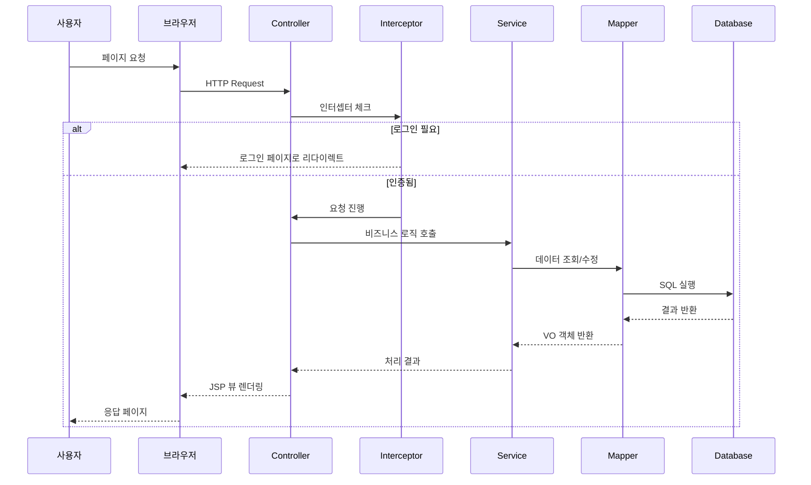
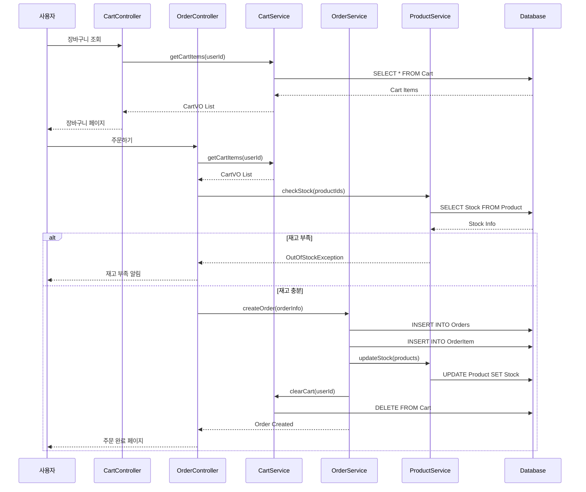
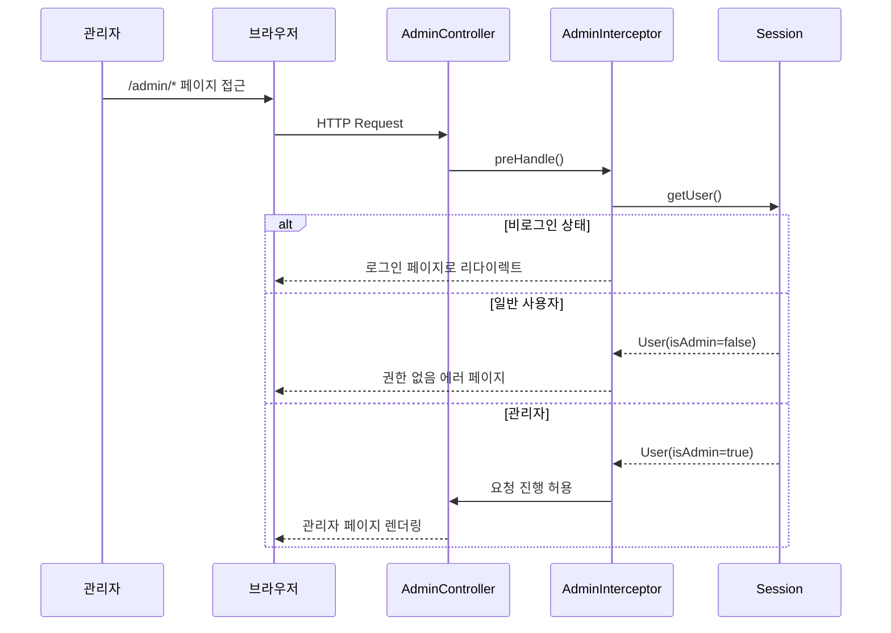

# 주요 프로세스 플로우 다이어그램

## 사용자 요청 처리 흐름

```mermaid
sequenceDiagram
    participant U as 사용자
    participant B as 브라우저
    participant C as Controller
    participant I as Interceptor
    participant S as Service
    participant M as Mapper
    participant D as Database
    
    U->>B: 페이지 요청
    B->>C: HTTP Request
    C->>I: 인터셉터 체크
    alt 로그인 필요
        I-->>B: 로그인 페이지로 리다이렉트
    else 인증됨
        I->>C: 요청 진행
        C->>S: 비즈니스 로직 호출
        S->>M: 데이터 조회/수정
        M->>D: SQL 실행
        D-->>M: 결과 반환
        M-->>S: VO 객체 반환
        S-->>C: 처리 결과
        C-->>B: JSP 뷰 렌더링
        B-->>U: 응답 페이지
    end
```

## 주문 처리 흐름

```mermaid
sequenceDiagram
    participant U as 사용자
    participant C as CartController
    participant O as OrderController
    participant CS as CartService
    participant OS as OrderService
    participant PS as ProductService
    participant D as Database
    
    U->>C: 장바구니 조회
    C->>CS: getCartItems(userId)
    CS->>D: SELECT * FROM Cart
    D-->>CS: Cart Items
    CS-->>C: CartVO List
    C-->>U: 장바구니 페이지
    
    U->>O: 주문하기
    O->>CS: getCartItems(userId)
    CS-->>O: CartVO List
    O->>PS: checkStock(productIds)
    PS->>D: SELECT Stock FROM Product
    D-->>PS: Stock Info
    
    alt 재고 부족
        PS-->>O: OutOfStockException
        O-->>U: 재고 부족 알림
    else 재고 충분
        O->>OS: createOrder(orderInfo)
        OS->>D: INSERT INTO Orders
        OS->>D: INSERT INTO OrderItem
        OS->>PS: updateStock(products)
        PS->>D: UPDATE Product SET Stock
        OS->>CS: clearCart(userId)
        CS->>D: DELETE FROM Cart
        OS-->>O: Order Created
        O-->>U: 주문 완료 페이지
    end
```

## 관리자 인증 흐름

```mermaid
sequenceDiagram
    participant A as 관리자
    participant B as 브라우저
    participant AC as AdminController
    participant AI as AdminInterceptor
    participant S as Session
    
    A->>B: /admin/* 페이지 접근
    B->>AC: HTTP Request
    AC->>AI: preHandle()
    AI->>S: getUser()
    
    alt 비로그인 상태
        AI-->>B: 로그인 페이지로 리다이렉트
    else 일반 사용자
        S-->>AI: User(isAdmin=false)
        AI-->>B: 권한 없음 에러 페이지
    else 관리자
        S-->>AI: User(isAdmin=true)
        AI->>AC: 요청 진행 허용
        AC-->>B: 관리자 페이지 렌더링
    end
```