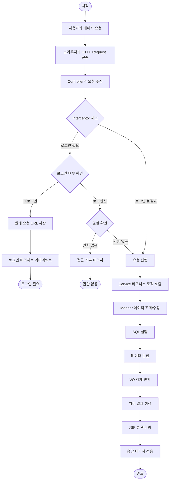

# 프로세스 플로우

## 사용자 요청 처리 흐름



## 주문 처리 흐름


## 관리자 인증 흐름

```mermaid
flowchart TD
    Start([시작]) --> AdminAccess[/admin/* 페이지 접근]
    AdminAccess --> SendRequest[HTTP Request 전송]
    SendRequest --> InterceptorCheck[AdminInterceptor.preHandle 실행]
    InterceptorCheck --> GetSession[세션에서 사용자 정보 조회]
    
    GetSession --> CheckUser{사용자 정보 확인}
    
    CheckUser -->|비로그인| NoUser[사용자 정보 없음]
    NoUser --> RedirectLogin[로그인 페이지로 리다이렉트]
    RedirectLogin --> LoginRequired([로그인 필요])
    
    CheckUser -->|로그인됨| HasUser[사용자 정보 있음]
    HasUser --> CheckAdmin{관리자 권한 확인}
    
    CheckAdmin -->|일반 사용자| NotAdmin[isAdmin = false]
    NotAdmin --> ShowError[권한 없음 에러 페이지]
    ShowError --> AccessDenied([접근 거부])
    
    CheckAdmin -->|관리자| IsAdmin[isAdmin = true]
    IsAdmin --> AllowRequest[요청 진행 허용]
    AllowRequest --> ProcessRequest[AdminController 처리]
    ProcessRequest --> RenderPage[관리자 페이지 렌더링]
    RenderPage --> End([완료])
```

## 로그인 처리 흐름


## 회원가입 처리 흐름


## 장바구니 추가 처리 흐름


## 상품 리뷰 작성 흐름


## 게시글 작성 및 댓글 처리 흐름


## 관리자 대시보드 조회 흐름

```mermaid
flowchart TD
    Start([시작]) --> AccessDashboard[관리자 대시보드 접근]
    AccessDashboard --> AdminRequest[GET /admin/dashboard 요청]
    AdminRequest --> AdminInterceptor[관리자 인터셉터 체크]
    AdminInterceptor --> CheckAdminAuth{관리자 권한 확인}
    
    CheckAdminAuth -->|권한 없음| DenyAccess[접근 거부]
    DenyAccess --> End1([권한 없음])
    
    CheckAdminAuth -->|관리자 확인| AllowAccess[요청 진행 허용]
    AllowAccess --> LoadStats[통계 데이터 로드]
    
    LoadStats --> GetUserCount[회원 수 조회]
    GetUserCount --> QueryUserCount[SELECT COUNT(*) FROM User]
    QueryUserCount --> UserCount[150명]
    
    UserCount --> GetProductCount[상품 수 조회]
    GetProductCount --> QueryProductCount[SELECT COUNT(*) FROM Product]
    QueryProductCount --> ProductCount[50개]
    
    ProductCount --> GetOrderCount[주문 수 조회]
    GetOrderCount --> QueryOrderCount[SELECT COUNT(*) FROM Orders]
    QueryOrderCount --> OrderCount[320건]
    
    OrderCount --> GetPendingOrders[대기 중 주문 조회]
    GetPendingOrders --> QueryPending[SELECT * FROM Orders WHERE status = 'PENDING']
    QueryPending --> PendingList[대기 주문 목록]
    
    PendingList --> GetRecentOrders[최근 주문 조회]
    GetRecentOrders --> QueryRecent[SELECT * FROM Orders ORDER BY createdAt DESC LIMIT 10]
    QueryRecent --> RecentList[최근 주문 10건]
    
    RecentList --> PrepareData[대시보드 데이터 준비]
    PrepareData --> RenderDashboard[대시보드 페이지 렌더링]
    RenderDashboard --> ShowDashboard[통계 및 주문 정보 표시]
    ShowDashboard --> End2([완료])
```

## 상품 검색 처리 흐름


## 주문 상태 변경 흐름 (관리자)

```mermaid
flowchart TD
    Start([시작]) --> SelectOrder[변경할 주문 선택]
    SelectOrder --> SelectStatus[새로운 상태 선택]
    SelectStatus --> SubmitChange[상태 변경 요청]
    SubmitChange --> PostRequest[POST /admin/order/updateStatus]
    
    PostRequest --> CallUpdate[OrderService.updateOrderStatus 호출]
    CallUpdate --> GetOrder[주문 정보 조회]
    GetOrder --> QueryOrder[SELECT * FROM Orders WHERE orderID = ?]
    QueryOrder --> CheckStatus{현재 상태 확인}
    
    CheckStatus -->|이미 배송 시작| ShippedStatus[status = "SHIPPED"]
    ShippedStatus --> CannotCancel[취소 불가능]
    CannotCancel --> ShowError[상태 변경 불가 메시지]
    ShowError --> End1([변경 불가])
    
    CheckStatus -->|변경 가능| CanChange[상태 변경 가능]
    CanChange --> UpdateStatus[주문 상태 업데이트]
    UpdateStatus --> UpdateOrder[UPDATE Orders SET status = ?]
    
    UpdateOrder --> CheckCancellation{주문 취소인가?}
    CheckCancellation -->|아니오| NotCancellation[일반 상태 변경]
    CheckCancellation -->|예| IsCancellation[주문 취소 처리]
    
    IsCancellation --> GetOrderItems[주문 상품 목록 조회]
    GetOrderItems --> RestoreStock[재고 복원]
    RestoreStock --> UpdateStock[UPDATE Product SET stock = stock + ?]
    
    UpdateStock --> UpdateSuccess[상태 변경 성공]
    NotCancellation --> UpdateSuccess
    UpdateSuccess --> RefreshOrder[주문 정보 새로고침]
    RefreshOrder --> ShowUpdated[업데이트된 주문 정보 표시]
    ShowUpdated --> End2([완료])
```