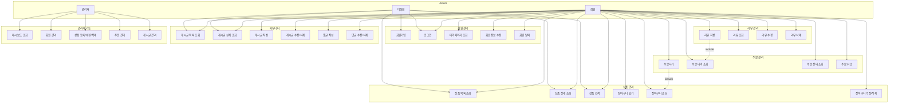

# Use Case Diagram

시스템의 주요 액터(Actor)와 유스케이스(Use Case)를 나타낸 다이어그램입니다.

```mermaid
graph TB
    subgraph "Actors"
        Guest[비회원]
        User[회원]
        Admin[관리자]
    end
    
    subgraph "회원 관리"
        UC1[회원가입]
        UC2[로그인]
        UC3[마이페이지 조회]
        UC4[회원정보 수정]
        UC5[회원 탈퇴]
    end
    
    subgraph "상품 관리"
        UC6[상품 목록 조회]
        UC7[상품 상세 조회]
        UC8[상품 검색]
        UC9[장바구니 담기]
        UC10[장바구니 조회]
        UC11[장바구니 수정/삭제]
    end
    
    subgraph "주문 관리"
        UC12[주문하기]
        UC13[주문 내역 조회]
        UC14[주문 상태 조회]
        UC15[주문 취소]
    end
    
    subgraph "리뷰 관리"
        UC16[리뷰 작성]
        UC17[리뷰 조회]
        UC18[리뷰 수정]
        UC19[리뷰 삭제]
    end
    
    subgraph "커뮤니티"
        UC20[게시글 목록 조회]
        UC21[게시글 상세 조회]
        UC22[게시글 작성]
        UC23[게시글 수정/삭제]
        UC24[댓글 작성]
        UC25[댓글 수정/삭제]
    end
    
    subgraph "관리자 기능"
        UC26[대시보드 조회]
        UC27[회원 관리]
        UC28[상품 등록/수정/삭제]
        UC29[주문 관리]
        UC30[게시글 관리]
    end
    
    %% Guest relationships
    Guest --> UC1
    Guest --> UC2
    Guest --> UC6
    Guest --> UC7
    Guest --> UC8
    Guest --> UC20
    Guest --> UC21
    
    %% User relationships
    User --> UC2
    User --> UC3
    User --> UC4
    User --> UC5
    User --> UC6
    User --> UC7
    User --> UC8
    User --> UC9
    User --> UC10
    User --> UC11
    User --> UC12
    User --> UC13
    User --> UC14
    User --> UC15
    User --> UC16
    User --> UC17
    User --> UC18
    User --> UC19
    User --> UC20
    User --> UC21
    User --> UC22
    User --> UC23
    User --> UC24
    User --> UC25
    
    %% Admin relationships
    Admin --> UC26
    Admin --> UC27
    Admin --> UC28
    Admin --> UC29
    Admin --> UC30
    
    %% Include relationships
    UC12 -.include.-> UC10
    UC16 -.include.-> UC13
```